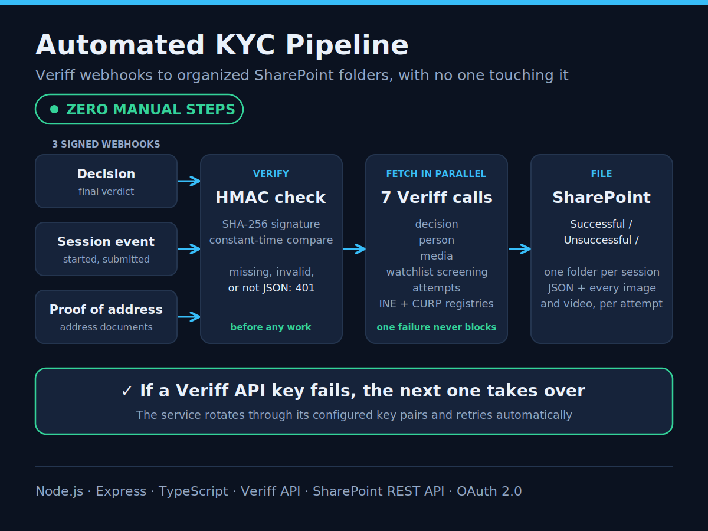

# Veriff KYC Server

Automated KYC pipeline: signed Veriff webhooks in, every identity check filed into SharePoint with no one touching it.



## What it does

- **Receives three Veriff webhooks:** decisions, session events (started and submitted), and proof of address.
- **Verifies every webhook.** The HMAC-SHA256 signature is checked with a constant-time comparison. Anything unsigned, invalid, or not JSON is rejected with a `401` before any work starts.
- **Fetches the full session in parallel.** Seven Veriff calls run at once (decision, person, media, watchlist screening, attempts, INE and CURP registries) with `Promise.allSettled`, so one failing endpoint never blocks the rest.
- **Keeps every image and video, for every attempt.** Media is streamed from Veriff and uploaded per verification attempt.
- **Files everything into SharePoint, sorted by outcome.** Decisions go to `Successful/` or `Unsuccessful/`, session events to `Started/` or `Submitted/`.
- **Fails over across API keys.** With several Veriff key pairs configured, a failing key hands over to the next one automatically.
- **Reports failures honestly.** Any error while fetching or filing returns an error status instead of a false success, and the server keeps running.

## Output in SharePoint

Example for a decision webhook:

```
KYC Details/
├─ Successful/
│  └─ Jane Doe_<session-id>/
│     ├─ personInfo.json
│     ├─ sessionDecision.json
│     ├─ watchlistScreening.json
│     ├─ attempts.json
│     ├─ mediaList.json
│     └─ <attempt-id>/
│        └─ DecisionEvent/
│           ├─ document-front.jpeg
│           ├─ document-back.jpeg
│           └─ face.jpeg
└─ Unsuccessful/
```

## Webhook endpoints

| Method | Path | Veriff webhook |
|---|---|---|
| `POST` | `/webhooks/decision` | Decision |
| `POST` | `/webhooks/verification-event` | Session events (started, submitted) |
| `POST` | `/webhooks/proof-of-address` | Proof of address |

Every endpoint requires a valid `x-hmac-signature` header.

## Security

- HMAC-SHA256 verification on every incoming webhook, compared with `crypto.timingSafeEqual`
- Every outgoing Veriff request signed with `X-HMAC-SIGNATURE` for its resource ID
- SharePoint access through OAuth 2.0 client credentials (app-only), with no user account involved
- Secrets live in `.env`, which is git-ignored

## Tech stack

Node.js, Express 5, TypeScript, Axios, Veriff API, SharePoint REST API

## Configuration

Copy `.env.example` to `.env` and fill in:

| Variable | Description |
|---|---|
| `PORT` | Port the server listens on (default `3000`) |
| `API_KEYS` | JSON array of Veriff key pairs, each with `apiKey` and `sharedSecretKey` |
| `BASE_URL` | Base URL of the Veriff API |
| `VERSION` | Version number for Veriff registry checks |
| `TENANT_ID` | Azure AD tenant ID |
| `CLIENT_ID` | SharePoint app client ID |
| `CLIENT_SECRET` | SharePoint app client secret |
| `RESOURCE` | SharePoint resource identifier |
| `SITE_DOMAIN` | Domain of the SharePoint site |
| `SUBSITE` | SharePoint subsite that receives the files |

## Getting started

```bash
git clone https://github.com/ali-hassan-dev/veriff-kyc-server.git
cd veriff-kyc-server
npm install
cp .env.example .env    # then fill in the values
npm run build
npm start               # or: npm run dev
```

## Project structure

```
src/
├─ app.ts                        Express server and the three webhook routes
├─ services/
│  ├─ VeriffAPI.ts               Veriff client: request signing, key failover, signature checks
│  ├─ BaseWebhookHandler.ts      Shared SharePoint auth and media upload
│  ├─ DecisionEvents.ts          Decision webhook handler
│  ├─ VerificationEvents.ts      Session event webhook handler
│  └─ ProofOfAddress.ts          Proof of address webhook handler
├─ utils/
│  ├─ veriff-utils.ts            Parallel session fetch with Promise.allSettled
│  └─ sharepoint-utils.ts        SharePoint REST helpers: auth, folders, uploads
└─ types/index.ts
```

## License

ISC
